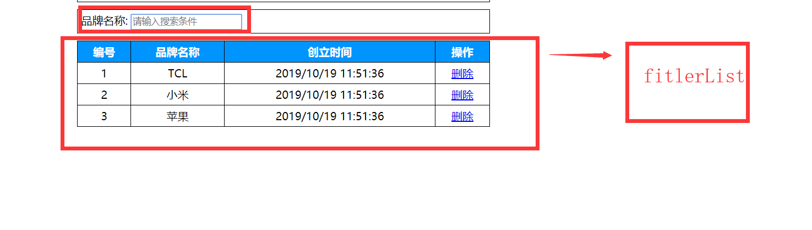

# Vue基础第三天笔记

## 反馈 

## 复习 

## 基础-Vue过滤器-过滤器的文档分析

>**`目标`**: 了解过滤器的功能 作用以及作用场景
>
>* 场景: data中的数据格式(日期格式/货币格式/大小写等)需要数据时  可以采用过滤器函数来进行处理
>* 使用位置:{{ }}和v-bind="表达式"   v-bind:属性="表达式"
>* 具体用法:{{msg + 1 +2 +3 **`|`** 过滤器名字}}  或  v-bind:属性="表达式 **`|`** 过滤器名称"
>* 分类:本地(局部)和全局  全局 所有实例均可使用  Vue
>* 全局和局部的区别: 全局就是**`所有的Vue实例`**都可以使用该过滤器 
>* 局部:只有**`当前实例`**才可以使用过滤器 
>* 全局和局部:注册位置不同,**`应用范围不同`**
>* 过滤器函数 必须 有return返回值,因为return返回值会显示在所用的位置
>* 本地: 通过选项filters
>* 全局: 在newVue上面 Vue.filter()

## 基础-过滤器-全局过滤器

>**`目标`**:掌握如何注册一个全局过滤器
>
>1. 在创建 Vue 实例**`之前`**定义全局过滤器**`Vue.filter`**()
>
>2. Vue.filter('该过滤器的名字',(要过滤的数据)=>{return 对数据的处理结果});
>
>3. 在视图中通过{{数据 | 过滤器的名字}}或者v-bind使用过滤器
>
>   ```js
>   Vue.filter("toUpper", function(value) {
>   return value.charAt(0).toUpperCase() + value.substr(1);
>   });// 过滤器核心代码
>   ```
>
>****
>
>**注意** 可使用多种表达式形式  全局过滤器 多个Vue实例可共享使用
>
>```html
><p>{{ text | toUpper }}</p>  // 常规用法
>or
><p>
>{{
>text
>  .split("")
>  .reverse()
>  .join("") | toUpper
>}}
></p>  // 将字符串翻转
>```
>
>
>
>**`任务`**: 注册一个全局过滤器,实现 abc 转成 Abc的功能
>
>       1.  定义全局过滤器
>       2.  过滤器功能实现
>           3.    过滤器使用
> 
>**`路径`**参照实现代码

## 基础-过滤器-局部过滤器

>**`目标`**掌握如何注册一个局部过滤器
>
>1. 在vm对象的选项中配置过滤器filters:{}
>2. 过滤器的名字: (要过滤的数据)=>{return 过滤的结果}
>3. 在视图中使用过滤器:  {{被过滤的数据 | 过滤器的名字}}
>
>```js
>filters: {
>toUpper(value) {
>  return value.charAt(0).toUpperCase() + value.substr(1);
>}
>}
>```
>
>**注意** 局部过滤器只能用在当前Vue实例视图上
>
>**`任务: `**注册一个局部过滤器,实现 abc 转成 Abc的功能
>
>1. 定义局部过滤器
>2. 过滤器功能实现
>
>3. 过滤器使用
>
>**`路径`**参照实现代码

## 基础-过滤器-传参数和串联使用

> **`目标`**掌握在过滤器中如何传参数 和串行使用
>
> * 过滤器可以传递参数,**`第一个参数永远是前面传递过来的过滤值`** 后边的参数以此类推
> * 过滤器也可以多个串行起来并排使用,
>
> ```js
> // index为传入的参数 
> toUpper(value, index) {
>       return value
>         .split("")
>         .map(function(item, i) {
>           if (i === index) {
>             return item.toUpperCase();
>           }
>           return item;
>         })
>         .join("");
>     }
> } // 根据传入的索引找到对应的字母换成大写字母
> ```
>
> ```html
> <p>{{ text | toUpper(2) }}</p>  
> 
> ```
>
> * 串行使用 过滤器
>
> ```html	
> <p>{{ text | toUpper(2) | reverse }}</p> // 语法 多个过滤器用 | 分割
> 
> ```
>
> **`任务`**:实现一个过滤器,可以根据传去的索引,找到对应的字符转成大写
>
> 1. 定义局部过滤器
> 2. 实现功能
> 3. 过滤器使用
> 4. 定义第二个过滤器,可以将传去的字符反转(扩展)
>
> **`路径`**参照实现代码

## 基础-表格案例-使用过滤器完成日期 格式处理

>**`目标-任务`**利用所学过滤器知识 完成日期格式处理
>
>​       路径:实现列表中日期的格式化
>
>​       1 . 引入 第三方格式化日期插件 
>
>​       2 . 定义格式化日期过滤器
>
>​       3.  实现其格式化功能 
>
>​       4 .  使用过滤器
>
>```js
>formatDate(value, format) {
>  return moment(value).format(format);
>}  // 过滤器代码
>```
>
>**`路径`**: 参照实现代码

## 基础-ref 操作 DOM

>**`目标`**掌握如何通过ref来获取dom对象
>
>* 作用: 通过ref特性可以获取元素的dom对象
>
>* 使用:  给元素定义 ref属性, 然后通过**`$refs`**.**`名称`** 来获取dom对象
>
>```html
><input type="text" ref="myInput" /> // 定义ref
>
>```
>
>```js
>focus() {
>  this.$refs.myInput.focus();
>}  // 获取dom对象 聚焦
>```
>
>**`任务`**  通过ref功能,点击按钮时获取input的value值 
>
>1. 实例化Vue实例
>2. 定义input的ref属性
>3. 注册按钮事件
>4. 按钮事件中通过ref获取input的value内容
>
>**`路径`**: 参照实现代码

## 基础-自定义指令-全局自定义指令

> **`目标`**掌握如何全局自定义一个指令
>
> - 使用场景:需要对普通 DOM 元素进行操作，这时候就会用到自定义指令 
> - 分类:全局注册和局部注册
>
> 1. 在创建 Vue 实例之前定义全局自定义指令**`Vue.directive()`**
> 2. Vue.directive('**`指令的名称`**',{ inserted: (使用指令的DOM对象) => { 具体的DOM操作 } } );
> 3. 在视图中通过"v-自定义指令名"去使用指令

```js
 // 定义指令
//  自定义指令是不需要加v-前缀的
// 第二个参数为一个对象  对象中要实现 inserted的方法
// inserted中的参数为当前指令所在元素的dom对象
Vue.directive("focus", {
        inserted(dom) {
          dom.focus();
        }
      });
```

>**`注意`**;目前所讲的只是自定义指令的基本用法,高阶用法在这里[自定义指令高阶用法]( https://cn.vuejs.org/v2/guide/custom-directive.html#ad )
>
>**`任务`** 实现一个可以自动聚焦input的自定义指令v-focus
>
>**`路径`**参照实现代码

## 基础-自定义指令-局部自定义指令

>**`目标:`**掌握如何自定义一个局部指令
>
>Vue的选项上 directives:{ key(指令名称):{ inserted:function(obj){} } }
>
>```js
>directives: {
>focus: {
>inserted(dom) {
>dom.focus();
>}
>}
>} // 局部自定义指令实现
>```
>
>**`任务`** 实现一个可以自动聚焦input的自定义指令v-focus
>
>**`路径`**参照实现代码

## 基础-表格案例-使用自定义指令完成自动获取焦点功能

> **`目标-任务`**在表格案例中 实现自定义指令 完成 输入框自动聚焦功能
>
> **`路径`**参照实现代码

## 基础-实例选项-计算属性-体验及文档分析

> **`目标`** 掌握实例选项中计算属性的基本含义
>
> * 场景:当表达式过于复杂的情况下 可以采用计算属性 对于任何复杂逻辑都可以采用计算属性
> * 使用: 在Vue实例选项中 定义 computed:{ 计算属性名: **`带返回值`**的函数 }
> * 说明: 计算属性的值 依赖 数据对象中的值  数据对象发生改变 => 计算属性发生改变=> 视图改变
> * 计算属性**`必须有返回值`** 相当于对插值表达式**`逻辑的一次封装`**
>
> 方法和计算属性区别=> 方法 每次都会执行
>
>  计算属性会有智能更新模式 => 计算属性执行完一次之后,会将执行的结果缓存,如果计算属性依赖的数据没有发生过变化,那么计算属性永远会从缓存中取,如果发生了变化,会重新计算并缓存
>
> 计算属性的效率更高,有缓存机制,优于方法

## 基础-实例选项-计算属性-基本使用

>**`目标`** 掌握如何使用计算属性完成基本业务
>
> Vue实例代理了 Data中所有的属性,methods方法,代理了计算属性中所有的计算属性
>
>定义计算属性时 => 不能data中数据重名,不能和方法中的方法重名
>
>​       示例:  通过计算属性实现字符串的翻转
>
>​        1 定义数据对象 
>
>​        2 实现计算属性 
>
>​        3 使用计算属性
>
>​     -->
>
>```js	
>computed: {
>nameReverse() {
>return this.name
>.split("")
>.reverse()
>.join("");
>}
>} // 定义计算属性
>```
>
>当 数据对象中 name发生变化时  计算属性也会重新计算计算=> 改变页面视图
>
>计算属性 和 methods方法的区别: 
>
>* 计算属性不需要调用形式的写法  而methods方法必须采用 方法() 调用的形式
>
>* 计算属性依赖data中的数据变化,如果data并没有发生变化,则计算属性则会取缓存的结果,
>* methods不论data变化与否都会重新调用
>
>**`任务`:**通过计算属性实现一个通过查找索引 改变该索引的字符串为大写
>
>**`路径`**参考代码

## 表格案例-用计算属性实现商品搜索

>**`目标-任务`**在表格案例中使用计算属性实现商品搜索
>
>* 搜索框内容变化=> 列表内容变化
>
>* 计算属性:  依赖 输入值和 列表的变化实现
>
>​       使用计算属性实现品牌搜索
>
>​      1  定义 品牌搜索的内容
>
>​      2  定义计算属性 
>
>​      3  实现计算属性的筛选功能
>
>​      4  计算属性替换原有得列表数据
>
>```js
>computed: {
>// 实现计算属性
>newList() {
>  if (!this.searchValue) return this.list;
>  return this.list.filter(item => {
>    return item.name.startsWith(this.searchValue);
>  });
>}
>}
>```
>
>用到了 数组的filter筛选功能  和 字符串的 startsWith 校验功能
>
>

当data中无法完成复杂逻辑时,通通可以在**`计算属性`**中实现

## 在Vue中实现发送网络请求

>**`目标`**: 了解在Vue中发送网络请求
>
>在Vue.js中发送网络请求本质还是ajax，我们可以使用插件方便操作。
>
>1. vue-resource: Vue.js的插件，已经不维护，不推荐使用
>2. [axios](https://www.kancloud.cn/yunye/axios/234845) :**`不是vue的插件`**，可以在任何地方使用，推荐
>
>> 说明: 既可以在`浏览器端`又可以在**`node.js`**中使用的发送http请求的库，支持**`Promise`**，不支持jsonp
>>
>> **`Promise是链式调用`**
>>
>> 请求 工具 axios ,后台=> json-server => 工具
>>
>> 如果遇到jsonp请求, 可以使用插件 `jsonp` 实现
>

## 基础-json-server工具的使用

> **`目标`**掌握json-server工具的使用
>
> * 目的: 没有后端的支撑下 ,前端难以为继,json-server可以快速构建一个后台的接口服务,供前端调用
>
> ​     json-server 是一个**`命令行`**工具 可以json文件变成接口文件
>
> * json-server遵循**`restful接口规则`**
>
> 安装
>
> ```bash
> npm i -g  json-server // 也可以采用yarn 和 cnpm
> ```
>
> 新建一个json文件 db.json,并在相对目录下运行命令行命令
>
> ```bash
> json-server --watch db.json
> 
> ```

* 启动完成后=>  通过访问地址访问接口

>**`任务`**
>
>1. 安装json-server
>2. 新建db.json 写入json数据
>3. 启动json-server服务
>4. 通过访问地址访问接口

## 基础-RESTFUL的接口规则

> **`目标`**: 掌握restful接口规则
>
> - RESTful是一套接口设计规范
> - 用**`不同的请求类型`**发送**`同样一个请求标识`** 所对应的处理是`不同的`
> - 同样的请求标识 =>同一个地址
> - 不同的类型 => get/post/put/delete
> - 通过Http请求的不同类型(POST/DELETE/PUT/GET)来判断是什么业务操作(CRUD ) 
> - CRUD => **`增删改查`**
> - json-server应用了RESTful规范

**2. HTTP方法规则举例**

| **HTTP方法** | **数据处理** | **说明**                                           |
| ------------ | ------------ | -------------------------------------------------- |
| POST         | Create       | 新增一个没有id的资源                               |
| GET          | Read         | 取得一个资源                                       |
| PUT          | Update       | 更新一个资源。或新增一个含 id 资源(如果 id 不存在) |
| DELETE       | Delete       | 删除一个资源                                       |

1. 查询数据  GET  /brands 获取db.json下brands对应的所有数据 **`列表`**
2. GET /brands/1 查询id=1数据 **`单条`**
3. 删除数据 DELETE   /brands/1 删除id=1数据
4. 修改数据 PUT  /brands/1 请求体对象
5. 上传/添加 POST /brands 请求体对象

> PUT和POST用法一样  请求体 {name:"张三"}
>
> title是字段名

5. 查询 GET /brands?**`title`**_like=关键字  -> 模糊搜索

>**`任务`** 在json-server中测试体会restful接口规则
>
>

## 基础-postman测试接口

> **`目标`**学会使用postman测试接口
>
> * 说明:Postman是一款功能强大的网页调试与发送网页HTTP请求的测试工具
>
> **`任务`**安装postman工具,并启动son-server 测试json-server的crud接口
>
> 

## 基础-axios-介绍-及基本使用

>**`目标`**:掌握如何使用axios 
>
>axios支持promise
>
>promise是一种对于ajax**`回调地狱`**的一种 异形封装,它让代码看上去更优雅
>
>* 本地引入axios文件 
>
>* 在npm 中引入axios文件
>
>* ```js
>axios.get(url).then((res) => {
>// 请求成功 会来到这  res响应体
>}).catch((err) => {
>// 请求失败 会来到这 处理err对象
>	})	
>	```
>```js
>
>axios.get('http://localhost:3000/brands')
>.then(res => {
>console.log(res.data);
>})
>.catch(err => {
>console.dir(err)
>});
>```
>
>* 发送delete请求
>
>```js
>axios.delete('http://localhost:3000/brands/109')
>.then(res => {
>console.log(res.data);
>})
>.catch(err => {
>console.dir(err)
>});
>```
>
>* 发送post请求

> ```js
>axios.post('http://localhost:3000/brands', {name: '小米', date: new Date()})
>    .then(res => {
>    console.log(res);
>})
>    .catch(err => {
>    console.dir(err)
>});
> ```
>
>注意:**post 成功** status===**`201`** 其他是**`200`**
>
>**`任务`** 启动json-server 完成一个 getlist接口的访问
>
>**`路径`**参考代码
>
>

## 基础-表格案例-axios-列表

>**`目标-任务`** 将表格案例中列表数据实现用axios请求
>
> ​      **`路径`**: 使用axios请求列表
>
>​      1.  引入axios资源
>
>​      2.  在渲染完成时间中请求列表数据
>
>​      3.  赋值给data数据
>
>代码
>
>```js
>mounted() {
>     // 渲染完成事件
>     axios.get("http://localhost:3000/brands").then(result => {
>       this.list = result.data;
>          });
>        }
>     ```
>     
>     **注意** mounted 是一个事件,后面会讲到,指的是渲染完成事件

## 基础-表格案例-axios-删除商品

>**`目标-任务`**` 将表格案例中列表数据实现用axios删除
>
>​      **`路径`**: 使用axios请求列表
>
>​      1.  删除方法中传入ID
>
>​      2.  删除方法中调用删除接口
>
>​      3.  删除完成后重新调用请求接口
>
>代码
>
>```js
>  delItem(id) {
>       if (confirm("确定删除此条记录")) {
>         axios
>           .delete("http://localhost:3000/brands/" + id)
>           .then(result => {
>             this.getList(); // 重新调用拉取数据
>           });
>       }
>     }
>```
>
>​       路径: 使用axios删除商品
>
>​       1 删除方法中传入ID 
>
>​       2 删除方法中调用删除接口
>
>​       3 删除完成后重新调用接口
>
>```js
>delItem(id) {
>       if (confirm("确定删除此条记录")) {
>         axios
>           .delete("http://localhost:3000/brands/" + id)
>           .then(result => {
>             this.getList(); // 重新调用拉取数据
>           });
>       }
>     }
>```
>
>

## 基础-表格案例-axios-添加商品

>**`目标-任务`** 将表格案例中列表数据实现用axios添加
>
>​      **`路径`**: 使用axios请求列表
>
>​      1.  添加方法中调用新增接口 
>
>​      2. 添加成功后 拉取数据
>
>​      3.  清空输入框
>
>代码
>
>```js
>  addItem() {
>       // 添加商品
>       axios
>         .post("http://localhost:3000/brands", {
>           name: this.name,
>           date: new Date()
>         })
>         .then(result => {
>           if (result.status == 201) {
>             this.getList(); // 请求数据
>             this.name = ""; // 清楚文本框内容
>           }
>         });
>```
>
>

## 基础-表格案例-axios-搜索功能-分析

>**`目标`** 通过分析得出 计算属性不能进行搜索功能分析的结论
>
>计算属性=> 异步操作搜索=>返回结果 XXXXX 走不通
>
>结论: 搜索功能不能采用 **`计算属性`** 进行解决
>
>计算属性中一定是**`同步操作`**,如果有**`异步`**操作,则该业务逻辑就会失败
>
>新知识: 监听属性 watch

## 基础-实例选项-watch-文档分析

> **`目标`**:掌握watch 选项的基本功能含义
>
> 场景: 当需要根据数据变化 进行相应业务操作,且该操作是**`异步操作`**时,计算属性不能再使用,可以使用监听watch特性

## 基础-实例选项-watch-基本使用

>**`目标-任务`**-: 实现路径:city值发生改变时  生成新name的list
>
>​      1   实现 city的双向绑定  
>
>​        2  watch监听city的数据项改变 
>
>​        3  改变函数中实现
>
>* 计算属性和watch区别
>* 计算属性 必须要有返回值 所以说不能写异步请求 因为有人用它的返回值(插值表达式)
>* watch选项中可以写很多逻辑 不需要返回值 因为没有人用它的返回值
>
>代码
>
>```js
>watch: {
>     //newValue是最新的值 oldValue为后面的旧值
>     city(newValue, oldValue) {
>       this.list = this.list.map(item => ({
>         name: item.name,
>         group: newValue
>       }));
>     }
>}
>```
>
>

## 基础-表格案例-axios-搜索功能-实现

>**`目标-任务`**使用watch实现前后台搜索功能
>
>​         1. 监听搜索内容框 
>
>​         2. 在监听函数中实现搜索逻辑
>
>​         3.  将返回结果设置给 当前数据对象
>
>​         4.   更换数据对象
>
>代码
>
>```js
>   watch: {
>     searchValue(newValue) {
>            if (newValue) {
>              axios
>                .get("http://localhost:3000/brands?name_like=" + newValue)
>                .then(result => {
>                  this.list = result.data;
>                });
>            } else {
>              this.getList();
>            }
>           }
>        }
>     ```
>     


## 总结

