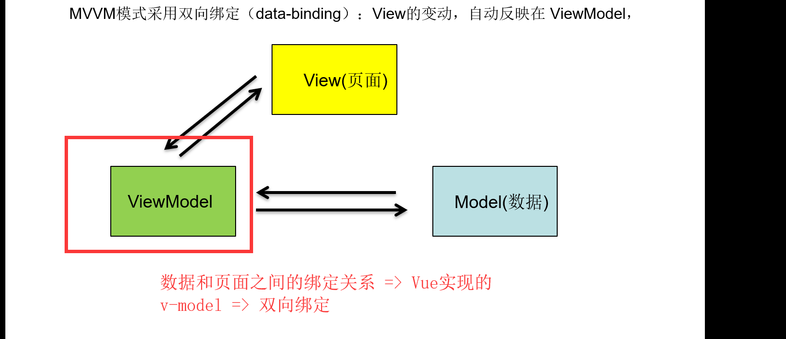
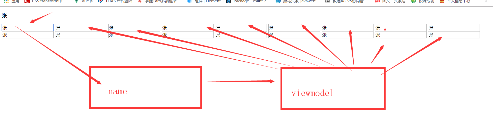

# Vue基础第二天笔记

## 反馈 

## 复习

## 基础-系统指令-v-for-对象

>**`目标`**:掌握v-for循环对象的用法 
>
>```html
><!DOCTYPE html>
><html lang="en">
>
>   <head>
>       <meta charset="UTF-8">
>       <meta name="viewport" content="width=device-width, initial-scale=1.0">
>       <meta http-equiv="X-UA-Compatible" content="ie=edge">
>       <title>Document</title>
>   </head>
>
>   <body>
>       <div id="app">
>           <!-- v-for作用:列表渲染,当遇到相似的标签结构时,就用v-for去渲染
>               v-for="元素 in 容器(数组和对象)"
>               v-for="对象中的属性值 in data中的对象名"
>           -->
>           <!-- 对象 -->
>           <!-- (v,k,i)in 对象
>               v:值
>               k:键
>               i:对象中每对key-value的索引 从0开始
>               注意: v,k,i是参数名,见名知意即可!
>           -->
>           <p v-for="value in per">{{value}}</p>
>           <hr>
>           <p v-for="(value,key) in per">{{value}}----{{key}}</p>
>           <hr>
>           <p v-for="(value,key,i) in per">{{value}}----{{key}}--{{i}}</p>
>
>       </div>
>       <script src="./vue.js"></script>
>       <script>
>           new Vue({
>               el: '#app',
>               data: {
>                   per: {
>                       name: '老王',
>                       age: 38,
>                       gender: '男'
>                   }
>               },
>               methods: {
>
>               }
>           })
>       </script>
>   </body>
>
></html>
>```
>
>
>
>语法:
>
>```js
>item in items  // item为当前遍历属性对象的值
>(item, key, index) in  items //item为当前遍历属性对象的值 key为当前属性名的值  index为当前索引的值
>```
>
>**`任务`**: 
>
>1. 初始化一个Vue实例
>2. 定义data对象中 person: { name: '张三', sex:'男',age: 18 }
>3. 将person中的内容 v-for循环在li标签上显示
>
>**`路径`**参照代码示例

## 基础-系统指令-v-for-key

> **`目标`**: 掌握在 v-for循环中给循环项赋值key
>
> - 场景:列表数据变动会导致 视图列表重新更新 为了 **`提升性能 方便更新`** 需要提供 一个属性 key=> 身份标识 => 
> - 使用: 通常是给列表数据中的唯一值 也可以用索引值
>
> ```html
> <div id="app">
> 
> <!-- v-for 
>     key属性: 值通常是一个唯一的标识
>     key是一个可选属性
>     养成好习惯:建议在写v-for时 设置:key="唯一值"
> -->
> <ul>
>     <li v-for="(item,index) in list" :key="index">{{item}}---{{index}}</li>
> </ul>
> </div>
> <script src="./vue.js"></script>
> <script>
> new Vue({
>     el: '#app',
>     data: {
>         list: ['a', 'b', 'c']
>     },
>     methods: {
> 
>     }
> });
> </script>
> ```
>
> 写v-for时,养成好习惯 给一个属性key  =>列表更新性能会高
>
> <p v-for="(item,index) in items" :key="index"></p>
>**`任务`**
> 
>1. 初始化一个Vue实例
> 2. 定义data对象中list:['北京','上海','天津']
> 3. 将list中的内容 v-for循环在li标签上显示
> 4. 给每个li标签赋值key

## 当v-if和v-for相遇

> **`目标`**: 了解v-if 和v-for的层级关系及使用
>
> - v-for循环元素时,标签可使用item属性, 如果这个时候用v-if来进行操作 会产生什么效果?
>
> ```html
> <p v-if="index>1" v-for="(item,index) in list"></p>
> ```
>
> 以上代码执行: 会将数组中前两个元素忽略掉
>
> 说明一个问题: v-for 的优先级大于v-if ,所有v-if才能使用v-for的变量,v-on/v-text/v-html
>
> * 如果遇到 v-if判断数组变量 需要在循环体外再建立一个判断 v-if
>
> **`任务`**: 
>
> 1. 初始化一个Vue实例
> 2. 定义一个 list:[ 4,4,3,2,22,2,4643,443,44,34,5,3 ]
>
> 3 将大于10 的列表渲染出来 使用v-for 和v-if
>
> **`路径`**参照代码示例

## 基础-表格案例-效果演示

> **`目标`**通过分析页面需求,提取案例功能点
>
> 功能点:  
>
> * 列表渲染
> * 输入框无值时 不可添加
>
> 1. 添加商品
> 2. 删除商品
> 3. 搜索商品
> 4. 列表循环 
> 5. 数据不存在 显示不存在数据
> 6. 时间格式

## 基础-表格案例-列表渲染

> **`目标-任务`**-完成表格案例的列表渲染
>
> **`路径`**
>
> 1. 静态页面 准备
> 2. 实例化一个Vue
> 3. 定义表格数据
> 4. 采用v-for 循环将静态内容切换为动态内容
> 5. 采用v-if控制提示消息
>
> 具体参考代码实现

## 基础-系统指令-v-bind的基本介绍

> **`目标`**掌握v-bind的绑定一般属性的用法
>
> * 作用:绑定标签上的任何属性
>* 场景: 当标签上的属性是变量/动态/需要改变的 
> * 语法:  <p :属性="数据对象中的属性名"></p>
>
> ```html
><p v-bind:id="ID"></p>   // ID为数据对象中的变量值 
> or 
> <p :id="ID"></p>  // 简写
> <p  :class="Class"></p> // class的字符串语法
> ```
> 
> **`任务`**
>
> 1. 实例化一个Vue实例
>2. 定义一个数据 id: test src:
> 3. 将id属性绑定给到p标签id属性  src属性绑定给img标签src属性 
> 
> **`路径`**参照实现代码

## 基础-系统指令-v-bind-绑定class-对象语法

>            **`目标`** 掌握v-bind绑定class的对象语法
>
>            * 绑定class对象语法    :class="{ class名称": 布尔值 }"
>
>            ```html
>               <p :class="{left:showClass}">内容</p>
>            ```
>
>            **注意**: 绑定class和原生class会进行合并
>
>            **`任务`**
>
>            1. 实例化一个Vue实例
>            2. 定义一个p标签 原有class 为default 
>            3. 使用v-bind对象语法将class变为 default primary
>
>            **`路径`**参照实现代码

## 基础-系统指令-v-bind-绑定class-数组语法

> **`目标`**掌握v-bind绑定class数组语法
>
> * 绑定class数组语法 :class="[class变量1,class变量2..]"
>
> ```html
> <p :class="[activeClass,selectClass]" class="default">内容</p>
> ```

>**`任务`**
>
>1. 实例化一个Vue实例
>2. 定义一个p标签 原有class 为default 
>3. 使用v-bind数组语法将class变为 default primary danger info
>
>**`路径`**参照实现代码


## 基础-系统指令-v-bind-绑定style-对象语法

> **`目标`**:掌握v-bind绑定style对象语法
>
> * 语法: :style="{css属性名: 变量}"
>
> ```html
> <p :style="{fonSize:fontsize}"></p>
> ```
>
> **注意** css属性名 例如 font-size要写成 fontSize  以此类推
>
> 原有的style不受影响
>
> **`任务`**
>
> 1. 实例化一个Vue实例
> 2. 定义一个p标签 原有样式 为字体红色
> 3. 使用v-bind绑定对象语法 将字体大小设置为48px ,加粗
>
> **`路径`**参照实现代码

## 基础-系统指令-v-bind-绑定style-数组语法

> **`目标`** 掌握v-bind绑定style的数组语法
>
> * 语法:  :style="[对象1,对象2...]"
>
> **注意** 对象可以是多个属性的 集合  同样里面的css属性需要遵从小驼峰命名的规则
>
> **`任务`**
>
> 1. 实例化一个Vue实例
> 2. 定义一个p标签 原有样式 为字体红色
> 3. 使用v-bind绑定数组语法 将字体大小设置为48px ,加粗
>
> **`路径`**参照实现代码

## 基础-系统指令-v-model-基础用法

> **`目标`:**掌握v-model的基础用法
>
> **`作用`:** 表单元素的绑定 input/checkbox/textarea
>
> 特点: **`双向数据绑定`**
>
> 
>
> 
>
> - 数据发生变化可以更新到界面 
> - 通过界面可以更改数据 =>  表单来修改
> - `v-model` 会忽略所有表单元素的 `value`、`checked`、`selected` 特性的初始值而总是将 Vue 实例的数据作为数据来源。应该在 `data`选项中声明初始值。
>
> **`任务`**
>
> 1. 实例化一个Vue实例
> 2. 定义一个数据对象 name:张三
> 3. 使用v-model实现 input和p标签的数据双向同步
>
> **`路径`**参照实现代码

## 基础-系统指令-v-model-语法糖原理

>**`目标`**:掌握 v-model的实现原理,
>
>v-on:事件名 =>@click
>
>**分析**   
>
>*  表单元素数据改变 => 数据发生改变
>
>   * 数据改变 => 页面数据变化
>
>```html
><div id="app">
><input type="text" @input="changeInput" :value="name" />
>{{ name }}
></div>
><script src="./vue.js"></script>
><script>
>var vm = new Vue({
>el: "#app",
>data: {
>name: "张三"
>},
>methods: {
>changeInput(event) {
>  // 值发生改变时 会触发这个方法
>  //  去value值
>  this.name = event.target.value;
>}
>}
>});
></script>
>```
>
>**`任务`**: 
>
>1. 实例化一个Vue实例
>2. 通过v-on指令和 v-bind指令 组合实现v-model效果
>
>**`路径`**参照上面代码

## 基础-系统指令-v-model-绑定其他表单元素

>  **`目标`**掌握 v-model绑定其他表单元素的方式
>
>  表单元素:  input  textarea checkbox radio  select 
>
>  **注意**  checkbox在input标签中需要给定value值
>
>  所有表单元素一旦绑定了 v-model  就会忽略掉 原有的value值 checked值 selected值  需要从数据对象中取默认值
>
>  **`任务`**:
>
>  1. 实例化一个Vue实例
>  2. input 绑定 属性 nameInput,实现input同步
>  3. textarea 绑定 属性 nameTextArea 实现textarea同步 
>  4. checkbox 绑定一个属性 nameCheckbox 实现 checkbox同步   
>  5. 多个 checkbox绑定同一个属性 nameCheckboxs 实现 checkbox同步           北京 上海 天津
>  6. radio 绑定属性 nameRadio 实现同步  男 女 
>  7. select  绑定属性 nameSelect 实现同步  北京 上海 天津 
>
>  **`路径`**参照实例代码

## 基础-系统指令-v-cloak

> **`目标`**学会使用v-cloak解决页面闪烁问题
>
> * 场景: 解决页面初次渲染时 页面模板闪屏现象
>
> ​       1.  编写元素标签
>
> ​        2.  写入v-cloak指令
>
> ​        3.  将v-cloak指令 属性加上style
>
> **注意**  可以一次性 将v-cloak引用在实例视图上  避免多次写入标签
>
> ```html
> <div v-cloak id="app">
>    <p>{{ name }}</p>
>    <p>{{ name }}</p>
>    <p>{{ name }}</p>
>    <p>{{ name }}</p>
>    <p>{{ name }}</p>
>    <p>{{ name }}</p>
>  </div>
> ```
>
> ```css
> [v-cloak] {
>      display: none;
>  }
> ```
>
> **`任务`**
>
> 1. 使用v-cloak解决页面闪烁问题

## 基础-系统指令-v-once

> **`目标`**掌握 使用v-once命令,只渲染一次页面视图
>
> * 作用: 使得所在元素只渲染一次  
>
> * 场景:静态化数据 
>
>   千万不能作用在 顶级的div上 => <div id="app"></div>
>
> **`任务`**
>
> 1. 使用v-once标记标签P
> 2. 测试更新数据时 p标签是否会渲染

## 基础-表格案例-添加商品

>**`目标- 任务`**  实现在表格案例中 添加商品
>
>  **`路径`**:  添加商品 
>
>           1.  绑定input 
>           2.  按钮绑定事件
>           3.  定义添加方法
>           4.  数组中添加元素
>           5.  清空input内容
>           6.  根据input内容框决定按钮是否可点击
>
>> **`路径`**参照实现代码
>
>

## 基础-表格案例-删除商品

>**`目标- 任务`**  实现在表格案例中 删除商品
>
> **`路径`**:  删除商品 
>
>   ​        1 绑定删除事件
>
>​        2 定义删除方法
>
>​        3 从数组中删除元素
>

## 基础-过滤器-过滤器的文档分析

>**`目标`**: 了解过滤器的功能 作用以及作用场景
>
>* 场景: data中的数据格式(日期格式/货币格式/大小写等)需要数据时
>
>* 使用位置:{{}}和v-bind="表达式"
>
>* 具体用法:{{msg | 过滤器名字}}
>
>* 分类:本地(局部)和全局  全局 所有实例均可使用  Vue
>
>* 本地: 通过选项filters
>
>* 全局: 在newVue上面 Vue.filter()

## 基础-过滤器-全局过滤器

>**`目标`**:掌握如何注册一个全局过滤器
>
>1. 在创建 Vue 实例**`之前`**定义全局过滤器Vue.filter()
>2. Vue.filter('该过滤器的名字',(要过滤的数据)=>{return 对数据的处理结果});
>3. 在视图中通过{{数据 | 过滤器的名字}}或者v-bind使用过滤器
>
>        ```js
>Vue.filter("toUpper", function(value) {
>     return value.charAt(0).toUpperCase() + value.substr(1);
> });// 过滤器核心代码
>        ```
>
>****
>
>**注意** 可使用多种表达式形式  全局过滤器 多个Vue实例可共享使用
>
>```html
><p>{{ text | toUpper }}</p>  // 常规用法
>or
><p>
>   {{
>     text
>       .split("")
>       .reverse()
>       .join("") | toUpper
>   }}
> </p>  // 将字符串翻转
>```
>
>
>
>**`任务`**: 注册一个全局过滤器,实现 abc 转成 Abc的功能
>
>        1.  定义全局过滤器
>           2.  过滤器功能实现
>            
>        3.    过滤器使用
>
>**`路径`**参照实现代码

## 基础-过滤器-局部过滤器

>**`目标`**掌握如何注册一个局部过滤器
>
>1. 在vm对象的选项中配置过滤器filters:{}
>2. 过滤器的名字: (要过滤的数据)=>{return 过滤的结果}
>3. 在视图中使用过滤器:  {{被过滤的数据 | 过滤器的名字}}
>
>```js
>filters: {
>     toUpper(value) {
>       return value.charAt(0).toUpperCase() + value.substr(1);
>     }
>   }
>```
>
>**注意** 局部过滤器只能用在当前Vue实例视图上
>
>**`任务: `**注册一个局部过滤器,实现 abc 转成 Abc的功能
>
>1. 定义局部过滤器
>2. 过滤器功能实现
>
>3.   过滤器使用
>
>**`路径`**参照实现代码

## 基础-过滤器-传参数和串联使用

> **`目标`**掌握在过滤器中如何传参数 和串行使用
>
> * 过滤器可以传递参数,第一个参数永远是前面传递过来的过滤值
> * 过滤器也可以多个串行起来并排使用,
>
> ```js
> // index为传入的参数 
> toUpper(value, index) {
>          return value
>            .split("")
>            .map(function(item, i) {
>              if (i === index) {
>                return item.toUpperCase();
>              }
>              return item;
>            })
>            .join("");
>        }
> } // 根据传入的索引找到对应的字母换成大写字母
> ```
>
> ```html
>    <p>{{ text | toUpper(2) }}</p>  
> 
> ```
>
> * 串行使用 过滤器
>
> ```html	
>    <p>{{ text | toUpper(2) | reverse }}</p> // 语法 多个过滤器用 | 分割
> 
> ```
>
> **`任务`**:实现一个过滤器,可以根据传去的索引,找到对应的字符转成大写
>
> 1. 定义局部过滤器
> 2. 实现功能
> 3. 过滤器使用
> 4. 定义第二个过滤器,可以将传去的字符反转(扩展)
>
> **`路径`**参照实现代码

## 基础-表格案例-使用过滤器完成日期 格式处理

>**`目标-任务`**利用所学过滤器知识 完成日期格式处理
>
> ​       路径:实现列表中日期的格式化
>
>​       1 . 引入 第三方格式化日期插件 
>
>​       2 . 定义格式化日期过滤器
>
>​       3.  实现其格式化功能 
>
>​       4 .  使用过滤器
>
>```js
>formatDate(value, format) {
>       return moment(value).format(format);
> }  // 过滤器代码
>```
>
>     **`路径`**: 参照实现代码

## 基础-ref 操作 DOM

>**`目标`**掌握如何通过ref来获取dom对象
>
>* 作用: 通过ref特性可以获取元素的dom对象
>
>* 使用:  给元素定义 ref属性, 然后通过$refs.名称 来获取dom对象
>
>```html
> <input type="text" ref="myInput" /> // 定义ref
>
>```
>
>```js
>focus() {
>       this.$refs.myInput.focus();
>}  // 获取dom对象 聚焦
>```
>
>**`任务`**  通过ref功能,点击按钮时获取input的value值 
>
>1. 实例化Vue实例
>2. 定义input的ref属性
>3. 注册按钮事件
>4. 按钮事件中通过ref获取input的value内容
>
>**`路径`**: 参照实现代码

## 基础-自定义指令-全局自定义指令

> **`目标`**掌握如何全局自定义一个指令
>
> - 使用场景:需要对普通 DOM 元素进行操作，这时候就会用到自定义指令 
> - 分类:全局注册和局部注册
>
> 1. 在创建 Vue 实例之前定义全局自定义指令Vue.directive()
> 2. Vue.directive('指令的名称',{ inserted: (使用指令的DOM对象) => { 具体的DOM操作 } } );
> 3. 在视图中通过"v-自定义指令名"去使用指令

```js
 // 定义指令
//  自定义指令是不需要加v-前缀的
// 第二个参数为一个对象  对象中要实现 inserted的方法
// inserted中的参数为当前指令所在元素的dom对象
Vue.directive("focus", {
        inserted(dom) {
          dom.focus();
        }
      });
```

>
>
>**`任务`** 实现一个可以自动聚焦input的自定义指令v-focus
>
>**`路径`**参照实现代码

## 基础-自定义指令-局部自定义指令

>**`目标:`**掌握如何自定义一个局部指令
>
>```js
>directives: {
>     focus: {
>       inserted(dom) {
>         dom.focus();
>       }
>     }
>} // 局部自定义指令实现
>    ```
>    
>     **`任务`** 实现一个可以自动聚焦input的自定义指令v-focus
>     
>     **`路径`**参照实现代码

## 基础-表格案例-使用自定义指令完成自动获取焦点功能

> **`目标-任务`**在表格案例中 实现自定义指令 完成 输入框自动聚焦功能
>
> **`路径`**参照实现代码


